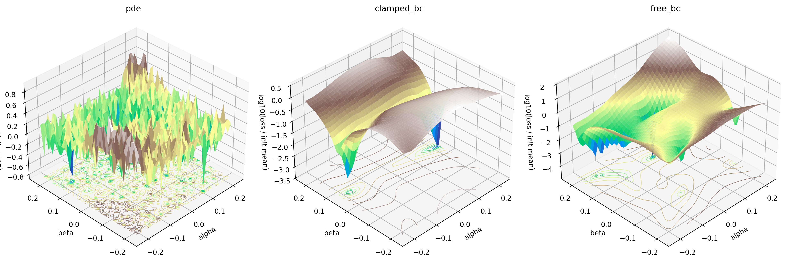

# EvoPINN: Large-scale Multiobjective Optimization for PINN Training

**Please use the PlatEMO platform for this competition.**

## Overview & Aim:

---

Physics-informed neural networks (PINNs) use neural networks to approximate the
solutions of differential equations.  Instead of relying only on labelled data,
a PINN is trained by minimizing physical losses, such as the PDE residual,
boundary-condition loss, initial-condition loss, data mismatch, or constitutive
residual.  Most existing PINN methods depend on gradient-based optimizers.

EvoPINN studies a different question: can black-box multiobjective optimizers
train PINNs directly in the neural-network parameter space?  In each EvoPINN
problem, the decision variables are the flattened network weights, and the
objectives are the raw PINN loss components.  The optimizer only receives
objective values from the evaluator.

This setting is difficult because PINN training spaces are high-dimensional,
expensive, sensitive to perturbations, and often have conflicting loss terms.
Small parameter changes may strongly affect one physical constraint while barely
changing another.  Therefore, this benchmark is intended to encourage new search
mechanisms that can produce real loss reduction, not only a diverse population.


Fig. 1 landscapes of `EvoPINN11`.  The three surfaces correspond to the `pde`,
`clamped_bc`, and `free_bc` objectives.

In this competition, twelve EvoPINN problems are provided.  They cover classical
PINN equations and data-driven PINN settings, with 2 or 3 objectives and up to
45,901 decision variables.  Participants are encouraged to develop a general
optimizer for all problems rather than a solver for one specific equation.

## Platform & Parameter settings

The competition uses MATLAB and PlatEMO.  The problem files are located in:

```text
PlatEMO/Problems/Multi-objective optimization/EvoPINN3M Neuroevolution MATLAB/
```

All problems have the same public interface.  The optional parameters are
`sampleScale` and `seed`.

```matlab
platemo('problem',@EvoPINN1,'algorithm',@NSGAII,'N',50,'maxFE',100000,'parameter',{1,1},'save',1)
```

The recommended public setting is:

```text
Population size: N = 50
Maximum function evaluations: maxFE = 100000
Evaluator sampling scale: sampleScale = 1
Evaluator seed: seed = 1
```

Participants should treat the evaluator as a black box.  Analytical gradients,
automatic-differentiation gradients, PDE-specific gradients, and modifications
to the problem files are not allowed.  Directional or finite-difference
information is allowed only if it is estimated through counted objective
evaluations.

* The test problems are

| Problem | PDE or task | M | D | Objectives |
| :-----: | :---------- | :-: | --: | :--------- |
| `EvoPINN1` | Poisson 1D | 2 | 5,251 | `pde`, `bc` |
| `EvoPINN2` | Multiscale Poisson 1D | 2 | 20,901 | `pde`, `bc` |
| `EvoPINN3` | Heat equation 1D | 3 | 921 | `pde`, `bc`, `ic` |
| `EvoPINN4` | Burgers equation 1D | 3 | 921 | `pde`, `bc`, `ic` |
| `EvoPINN5` | Allen-Cahn equation 1D | 3 | 921 | `pde`, `bc`, `ic` |
| `EvoPINN6` | Wave equation 1D | 3 | 21,201 | `pde`, `bc`, `ic` |
| `EvoPINN7` | Helmholtz equation 2D | 2 | 45,901 | `pde`, `bc` |
| `EvoPINN8` | Nonlinear Schrodinger equation 1D | 3 | 30,802 | `ic`, `periodic_bc`, `pde` |
| `EvoPINN9` | Discrete-time KdV equation 1D | 2 | 10,300 | `data_t0`, `data_t1` |
| `EvoPINN10` | Kovasznay flow 2D | 3 | 7,953 | `momentum`, `continuity`, `boundary_data` |
| `EvoPINN11` | Euler-Bernoulli beam 1D | 3 | 901 | `pde`, `clamped_bc`, `free_bc` |
| `EvoPINN12` | Linear elasticity 2D | 2 | 5,245 | `equilibrium`, `constitutive` |

## Submission

Participants should submit the source code of the optimizer, a short method
description, running instructions, required dependencies, and the result files
generated under the official settings.  The submitted algorithm should be
runnable through the PlatEMO interface, for example:

```matlab
platemo('problem',@EvoPINN1,'algorithm',@YourAlgorithm,'N',50,'maxFE',1e5,'save',20)
```

## Important Dates:

Competition dates will be announced by the organizers.

- Registration deadline: TBA
- Results submission deadline: TBA
- Notification: TBA

## Awards

Awards will be announced by the organizers.

## Competition Organizers:

Organizer information will be added before the official release.

## Citation

If you use EvoPINN in a paper, please cite the EvoPINN benchmark or competition
paper once it is available.  This repository is built on PlatEMO; please also
acknowledge PlatEMO in related publications.
