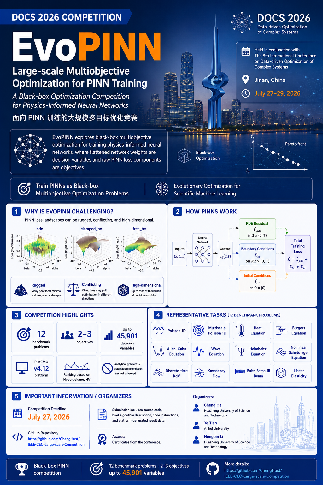
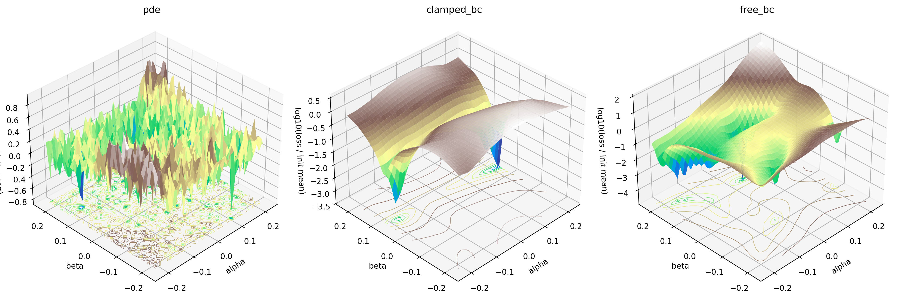

# IEEE CEC / DOCS Competition Collection

This repository collects competition releases organized by Cheng He and collaborators for large-scale, super large-scale, and PINN-related multiobjective optimization. The table below provides the same kind of entry point used in the algorithm collection repository: each period is listed with its theme, benchmark suite, platform package, and detailed page.

## Contents

| Period | Competition release | Benchmark suite | Scale and objectives | Platform package | Details |
| --- | --- | --- | --- | --- | --- |
| 2024 IEEE CEC | Super Large-scale Multiobjective Optimization for Status Assessment of Measuring Equipment | ETT1-ETT3 | 3 objectives; 1,251,016 to 125,100,016 decision variables | PlatEMO v4.4; see the 2024 page for LFS and Google Drive download notes | [README-2024.md](README-2024.md) |
| 2025 IEEE CEC | Large-scale Multiobjective Optimization for Status Assessment of Measuring Equipment | SAM1-SAM6 | 2 or 3 objectives; 10,000 to 100,000 decision variables | [PlatEMO(SAM2025).zip](PlatEMO(SAM2025).zip) | [README-2025.md](README-2025.md) |
| 2026 EvoPINN | Large-scale Multiobjective Optimization for PINN Training | EvoPINN1-EvoPINN12 | 2 or 3 objectives; 901 to 45,901 decision variables | [PlatEMO(EvoPINN).zip](PlatEMO(EvoPINN).zip) | Current README; [DOCS 2026 competition page](https://www.docs2026.com/EvoPINNCompetition.html) |

## Repository Layout

| Path | Role |
| --- | --- |
| [README-2024.md](README-2024.md) | Detailed 2024 ETT competition description, settings, dates, awards, and organizers. |
| [README-2025.md](README-2025.md) | Detailed 2025 SAM competition description, settings, dates, awards, and organizers. |
| [README.md](README.md) | Overview table plus the current 2026 EvoPINN competition description. |
| [PlatEMO(SAM2025).zip](PlatEMO(SAM2025).zip) | Platform package for the 2025 SAM competition. |
| [PlatEMO(EvoPINN).zip](PlatEMO(EvoPINN).zip) | Platform package for the 2026 EvoPINN competition. |

## Current Competition: EvoPINN

### EvoPINN: Large-scale Multiobjective Optimization for PINN Training

**Please download the PlatEMO platform (PlatEMO(EvoPINN).zip) for this competition!**



## Overview & Aim:

Physics-informed neural networks (PINNs) have become a powerful paradigm for solving partial differential equations (PDEs) by embedding physical laws into neural-network training. In a typical PINN, the model is optimized by minimizing several physical loss terms, such as the PDE residual, boundary-condition loss, initial-condition loss, and other constraint-related objectives. Recently, most existing PINN methods are built upon gradient-based optimization. Consequently, all the loss terms are optimized via predefined/adaptive weight aggregations, which may fail to find the optima due to the multiobjective conflicting nature of the PINN training task.

Thus, the EvoPINN competition tries to explore an alternative route: training PINNs as black-box multiobjective optimization problems in the parameter space of neural networks. In each EvoPINN task, the decision variables are the flattened network weights and biases, while the objectives are the raw PINN loss components. Participants are not allowed to use analytical gradients, automatic differentiation, or any modification of the provided evaluator. The optimizer must improve the PINN purely through black-box objective queries.


Fig. 1 landscapes of `EvoPINN11`.  The three surfaces correspond to the `pde`,
`clamped_bc`, and `free_bc` objectives.

This problem setting is highly challenging. PINN training landscapes are high-dimensional, computationally expensive, sensitive to parameter perturbations, and often exhibit strong conflicts among physical objectives. A search step that reduces one loss term may have little effect on another, or may even deteriorate it. Therefore, success in EvoPINN requires algorithms that can simultaneously promote convergence and preserve diversity, rather than relying solely on population spread.

The aim of this competition is to stimulate the development of new black-box optimization mechanisms for PINN training, especially for large-scale and expensive multiobjective settings. And the final ranking is based on hypervolume (HV).

Twelve EvoPINN benchmark problems are provided on the PlatEMO platform. These problems cover representative PINN tasks with 2 or 3 objectives and up to 45,901 decision variables. Participants are encouraged to develop a robust, general optimizer for the entire benchmark suite, rather than a method specialized to a single problem.

## Platform & Parameter settings

Participants are encouraged to develop an algorithm to solve these EvoPINN problems, propose a new optimization algorithm, or use a hybrid of previously proposed algorithms.
Notably, it is unrestricted in the field of evolutionary computation.
Participants must submit their source codes, a brief description of the optimization algorithm, a brief code instruction, and the data generated by the platform.
We'll review the quality of your submitted data for all three problems to ensure fairness.
With the same computational budget, the best solution for each problem obtained by randomly running your algorithm one time will be compared directly.

The PlatEMO v4.12 will be used as the competition platform for fair comparisons, with population size (N=100), number of function evaluations (maxFE=1e7), number of independent runs (run=20), and number of results (20). The code of an example is given as

```
platemo('problem',@EvoPINN1,'algorithm',@NSGAII,'N',100,'maxFE',1e7,'save',20)
```

Participants should treat the evaluator as a black box.  Analytical gradients, automatic-differentiation gradients, PDE-specific gradients, and modifications to the problem files are not allowed.  Directional or finite-difference information is allowed only if it is estimated through counted objective evaluations.

* The test problems are

| Problem | PDE or task | M | D | Objectives |
| :-----: | :---------- | :-: | --: | :--------- |
| `EvoPINN1` | Poisson 1D | 2 | 5,251 | `pde`, `bc` |
| `EvoPINN2` | Multiscale Poisson 1D | 2 | 20,901 | `pde`, `bc` |
| `EvoPINN3` | Heat equation 1D | 3 | 921 | `pde`, `bc`, `ic` |
| `EvoPINN4` | Burgers equation 1D | 3 | 921 | `pde`, `bc`, `ic` |
| `EvoPINN5` | Allen-Cahn equation 1D | 3 | 921 | `pde`, `bc`, `ic` |
| `EvoPINN6` | Wave equation 1D | 3 | 21,201 | `pde`, `bc`, `ic` |
| `EvoPINN7` | Helmholtz equation 2D | 2 | 45,901 | `pde`, `bc` |
| `EvoPINN8` | Nonlinear Schrodinger equation 1D | 3 | 30,802 | `ic`, `periodic_bc`, `pde` |
| `EvoPINN9` | Discrete-time KdV equation 1D | 2 | 10,300 | `data_t0`, `data_t1` |
| `EvoPINN10` | Kovasznay flow 2D | 3 | 7,953 | `momentum`, `continuity`, `boundary_data` |
| `EvoPINN11` | Euler-Bernoulli beam 1D | 3 | 901 | `pde`, `clamped_bc`, `free_bc` |
| `EvoPINN12` | Linear elasticity 2D | 2 | 5,245 | `equilibrium`, `constitutive` |

## Important Dates:

Competition dates will be announced by the organizers.

Deadline: the competition will be closed on July 27, 2026.


## Awards

Certificates from the conference.

## Competition Organizers:

* ***Cheng He***
  School of Electrical and Electronic Engineering, Huazhong University of Science and Technology, Wuhan 430074, China.
  chenghe_seee@hust.edu.cn
* ***Ye Tian***
  Institutes of Physical Science and Information Technology, Anhui University, Hefei 230601, China
  field910921@gmail.com
* ***Hongbin Li***
  School of Electrical and Electronic Engineering, Huazhong University of Science and Technology, Wuhan 430074, China.
  lihongbin@hust.edu.cn
  

## Citation

If you use EvoPINN in a paper, please cite the EvoPINN benchmark or competition paper once it is available.  This repository is built on PlatEMO; please also acknowledge PlatEMO in related publications.
